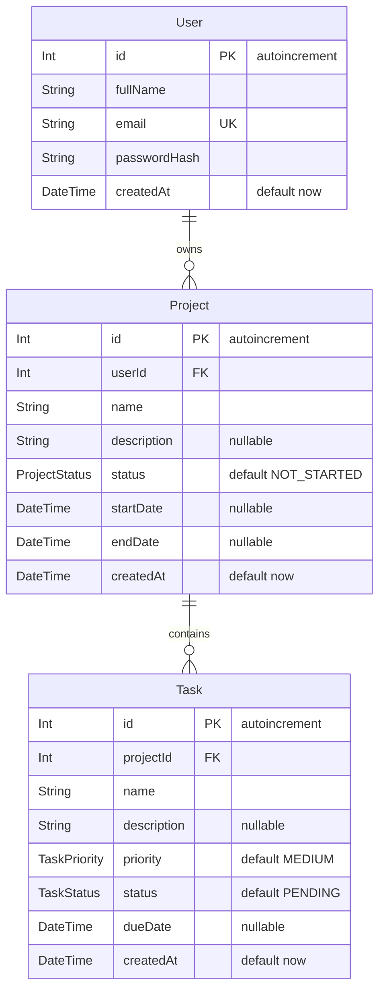

# Entity-Relationship Diagram

This diagram reflects the models and fields declared in [`backend/prisma/schema.prisma`](../backend/prisma/schema.prisma). Relation fields (`projects`, `user`, `tasks`, and `project`) describe Prisma relationships; the scalar `userId` and `projectId` fields are the foreign keys.

## Models

### User

Represents an account. `id` is an auto-incrementing primary key, `email` is unique, and `passwordHash` stores the password hash. A user has a `projects` relation to zero or more `Project` records.

### Project

Represents a project owned by a user. `userId` is a required foreign key to `User.id`. A project has a `tasks` relation to zero or more `Task` records. Its status defaults to `NOT_STARTED`; `description`, `startDate`, and `endDate` are nullable.

### Task

Represents work within a project. `projectId` is a required foreign key to `Project.id`. Its priority defaults to `MEDIUM`, status defaults to `PENDING`, and `description` and `dueDate` are nullable.

## Relationships and cardinality

- **User → Project:** `User.projects` and `Project.user` form a one-to-many relationship. Each project has exactly one related user through `Project.userId`; a user may have zero or more projects. `Project.userId` references `User.id`. Deleting a user cascades to their projects (`onDelete: Cascade`).
- **Project → Task:** `Project.tasks` and `Task.project` form a one-to-many relationship. Each task has exactly one related project through `Task.projectId`; a project may have zero or more tasks. `Task.projectId` references `Project.id`. Deleting a project cascades to its tasks (`onDelete: Cascade`).

## Enums

| Enum | Values |
| --- | --- |
| `ProjectStatus` | `NOT_STARTED`, `IN_PROGRESS`, `COMPLETED` |
| `TaskPriority` | `LOW`, `MEDIUM`, `HIGH` |
| `TaskStatus` | `PENDING`, `IN_PROGRESS`, `COMPLETED` |

## Indexes and unique constraints

- `User.id`, `Project.id`, and `Task.id` are primary keys.
- `User.email` has a unique constraint (`@unique`).
- `Project.userId` has an index (`@@index([userId])`).
- `Task.projectId` has an index (`@@index([projectId])`).
- No additional indexes or unique constraints are declared in the Prisma schema.
